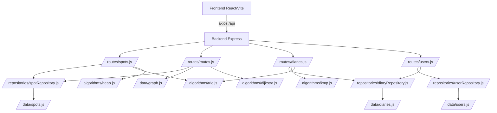

# Code Wiki（Our Tour System）
本仓库实现了一个“智能旅行推荐系统”的课程设计版 Demo：前端提供景点浏览/搜索、路线规划、日记社区等页面；后端提供 REST API，并在服务端内置若干“自主实现的数据结构与算法”（TopK 小顶堆、Dijkstra、多点路径近似、Trie/倒排索引、KMP 等）。

## 目录
- [1. 总览](#1-总览)
- [2. 仓库结构](#2-仓库结构)
- [3. 运行时架构与数据流](#3-运行时架构与数据流)
- [4. 后端（backend）](#4-后端backend)
  - [4.1 入口与中间件](#41-入口与中间件)
  - [4.2 路由模块（API）](#42-路由模块api)
  - [4.3 Repository 与数据源](#43-repository-与数据源)
  - [4.4 算法模块（algorithms）](#44-算法模块algorithms)
- [5. 前端（frontend）](#5-前端frontend)
  - [5.1 入口与路由](#51-入口与路由)
  - [5.2 API Client（axios 封装）](#52-api-clientaxios-封装)
  - [5.3 认证与权限（AuthContext）](#53-认证与权限authcontext)
  - [5.4 关键页面与组件](#54-关键页面与组件)
- [6. MCP Servers（mcp/）](#6-mcp-serversmcp)
- [7. 依赖关系图](#7-依赖关系图)
- [8. 配置与运行方式](#8-配置与运行方式)
  - [8.1 本地开发启动](#81-本地开发启动)
  - [8.2 生产构建（前端）](#82-生产构建前端)
  - [8.3 健康检查与简单验证](#83-健康检查与简单验证)
- [9. 测试现状](#9-测试现状)

---

## 1. 总览
**核心模块**
- 前端：React + Vite 单页应用（SPA），通过 axios 调后端 `/api/*`。
- 后端：Node.js + Express，提供景点/路线/日记/用户等 API；并在路由中调用算法模块完成 TopK、最短路、多点路线、文本检索等。
- 数据：当前版本使用 `src/backend/src/data/*.js` 内存数据（满足课程验收“数量级”要求），通过 Repository 层统一访问，便于未来替换数据库。

**关键入口**
- 后端入口：[index.js](file:///workspace/src/backend/src/index.js)
- 前端入口：[main.jsx](file:///workspace/src/frontend/src/main.jsx)、[App.jsx](file:///workspace/src/frontend/src/App.jsx)

---

## 2. 仓库结构
```
/workspace
  src/
    backend/                 # Express 后端
      src/
        index.js             # 后端入口
        routes/              # 路由层（REST API）
        repositories/        # 数据访问层（Repo）
        data/                # 内存数据源（spots/diaries/users/graph）
        algorithms/          # 自研数据结构与算法实现
    frontend/                # React + Vite 前端
      src/
        App.jsx              # 前端路由入口
        api/                 # axios 封装与 API 方法
        context/             # 全局状态（AuthContext）
        pages/               # 页面组件
        components/          # 复用 UI 组件
  mcp/
    servers/
      github-mcp-server/     # 一个可用的 MCP Server（TypeScript）
  tests/                     # 占位目录（当前未配置测试框架）
  DESIGN.md                  # 课程设计版《完整可落地设计报告》
  PROJECT_OVERVIEW.md        # 项目概览
```

---

## 3. 运行时架构与数据流
**端口**
- 前端开发服务器：5173（Vite）
- 后端 API：3001（Express）

**请求路径**
- 前端通过 axios 请求 `/api/...`
- Vite 在开发模式下将 `/api` 代理到 `http://localhost:3001`（见 [vite.config.js](file:///workspace/src/frontend/vite.config.js)）

**典型数据流（以路线规划为例）**
1. 前端 [RoutePlanner.jsx](file:///workspace/src/frontend/src/pages/RoutePlanner.jsx) 调用 API `shortestPath()` / `multiPointPath()`（见 [api/index.js](file:///workspace/src/frontend/src/api/index.js)）。
2. 请求到后端路由 [routes/routes.js](file:///workspace/src/backend/src/routes/routes.js)。
3. 路由调用算法 [dijkstra.js](file:///workspace/src/backend/src/algorithms/dijkstra.js) 计算路径，并用 [spotRepository.js](file:///workspace/src/backend/src/repositories/spotRepository.js) 将节点 id 映射为景点摘要。
4. 后端返回 JSON；前端渲染路径节点与总距离/总时间。

---

## 4. 后端（backend）
后端代码位于 [/workspace/src/backend](file:///workspace/src/backend)。

### 4.1 入口与中间件
后端入口为 [index.js](file:///workspace/src/backend/src/index.js)：
- 使用 `cors()` 与 `express.json()`。
- 挂载 4 组路由：
  - `/api/spots` → [routes/spots.js](file:///workspace/src/backend/src/routes/spots.js)
  - `/api/routes` → [routes/routes.js](file:///workspace/src/backend/src/routes/routes.js)
  - `/api/diaries` → [routes/diaries.js](file:///workspace/src/backend/src/routes/diaries.js)
  - `/api/users` → [routes/users.js](file:///workspace/src/backend/src/routes/users.js)
- 健康检查：`GET /api/health`

### 4.2 路由模块（API）

#### 4.2.1 景点（/api/spots）
实现文件：[routes/spots.js](file:///workspace/src/backend/src/routes/spots.js)

**初始化行为**
- 启动时构建：
  - `Trie`：用于前缀搜索 + 自动补全 + 模糊搜索（编辑距离阈值）
  - `FullTextIndex`：倒排索引用于全文检索
- 数据来源：`spotRepo.getAll()`（Repo 层内部来自内存数据）

**主要接口**
- `GET /api/spots`：列表 + 过滤 + 分页（`type/city/province/limit/offset`）
- `GET /api/spots/topk`：TopK 推荐（默认 `k=10`），算法：`MinHeap-TopK`
- `GET /api/spots/search`：搜索（`mode=prefix|fulltext|fuzzy`）
- `GET /api/spots/autocomplete`：自动补全（返回最多 8 条）
- `GET /api/spots/recommend`：按 city/tags/type 做综合推荐（仍用 TopK）
- `GET /api/spots/:id`：详情

#### 4.2.2 路线（/api/routes）
实现文件：[routes/routes.js](file:///workspace/src/backend/src/routes/routes.js)

**主要接口**
- `POST /api/routes/shortest`
  - 入参：`{ fromId, toId, mode: 'distance'|'time' }`
  - 算法：Dijkstra + 小顶堆（优先队列）
- `POST /api/routes/multi`
  - 入参：`{ waypointIds: number[], mode }`
  - 算法：最近邻（Nearest Neighbor）+ 2-opt（局部搜索）
- `GET /api/routes/nearby`
  - 入参：`spotId/maxDist/type/limit`
  - 说明：距离为“道路距离”，通过对 `spotId` 执行一次单源最短路得到
- `GET /api/routes/graph-stats`
  - 返回：边数、节点数、景点总数

#### 4.2.3 日记（/api/diaries）
实现文件：[routes/diaries.js](file:///workspace/src/backend/src/routes/diaries.js)

**初始化行为**
- 启动时对现有日记构建 `FullTextIndex`（倒排索引）

**主要接口**
- `GET /api/diaries`：列表（userId/spotId/tag 过滤 + sortBy/views/likes/createdAt + 分页）
- `GET /api/diaries/search`
  - `mode=kmp`：对多字段执行 KMP 检索，并返回 `_highlights`
  - `mode=fulltext`：倒排索引 AND 查询（按出现次数打分）
- `GET /api/diaries/:id`：详情
- `POST /api/diaries`：发布日记（成功后将新日记加入倒排索引）
- `POST /api/diaries/:id/like`：点赞
- `POST /api/diaries/:id/comment`：评论

#### 4.2.4 用户（/api/users）
实现文件：[routes/users.js](file:///workspace/src/backend/src/routes/users.js)

**主要接口**
- `GET /api/users`：用户列表
- `GET /api/users/:id`：用户详情 + 其日记
- `POST /api/users/login`：模拟登录（返回 `mock-token-*`）
- `POST /api/users`：注册（用户名唯一）

### 4.3 Repository 与数据源
Repository 的作用：让路由层与数据存储解耦；将来改成 DB 只需替换 repositories 中的实现。

**Repository**
- 景点 Repo：[spotRepository.js](file:///workspace/src/backend/src/repositories/spotRepository.js)
  - `findAll({type, city, province, limit, offset})`
  - `findById(id)`
  - `getAll()`
  - `create/update/delete`（为未来持久化预留）
- 日记 Repo：[diaryRepository.js](file:///workspace/src/backend/src/repositories/diaryRepository.js)
  - `findAll({userId, spotId, limit, offset})`
  - `findById(id)`
  - `create/update/delete`
  - `like(id)`、`addComment(id, comment)`
- 用户 Repo：[userRepository.js](file:///workspace/src/backend/src/repositories/userRepository.js)
  - `findAll()`（对外不返回 password 字段）
  - `findById(id)`
  - `findByUsername(username)`
  - `create/update`

**内存数据源**
- 景点/高校/设施数据（200+）：[spots.js](file:///workspace/src/backend/src/data/spots.js)
- 道路图边列表（≥200 边）：[graph.js](file:///workspace/src/backend/src/data/graph.js)
- 日记数据：[diaries.js](file:///workspace/src/backend/src/data/diaries.js)
- 用户数据：[users.js](file:///workspace/src/backend/src/data/users.js)

### 4.4 算法模块（algorithms）
算法实现位于 [/workspace/src/backend/src/algorithms](file:///workspace/src/backend/src/algorithms)。

#### 4.4.1 小顶堆与 TopK
文件：[heap.js](file:///workspace/src/backend/src/algorithms/heap.js)
- `class MinHeap`
  - `push(item)` / `pop()` / `peek()` / `isEmpty()`
  - 通过构造函数参数 `compareFn` 支持自定义排序
- `topK(items, k, keyFn)`
  - 使用“小顶堆维护 K 个最大值”，复杂度 `O(n log k)`
  - 默认按 `item.rating` 做 TopK

#### 4.4.2 Dijkstra、路径回溯与多点路线
文件：[dijkstra.js](file:///workspace/src/backend/src/algorithms/dijkstra.js)
- `buildGraph(edgesData)`：将边列表构建为邻接表 `Map<nodeId, edge[]>`（双向图）
- `dijkstra(graph, startId, mode)`：单源最短路
  - `mode='distance'|'time'` 决定边权选择 `dist` 或 `time`
- `getPath(prev, startId, endId)`：通过前驱表回溯路径
- `shortestPath(nodesData, edgesData, startId, endId, mode)`
- `multiPointPath(nodesData, edgesData, waypointIds, mode)`
  - 预计算途经点两两最短路矩阵
  - 最近邻生成初始顺序
  - 2-opt 进行局部改良

#### 4.4.3 Trie、编辑距离与倒排索引全文检索
文件：[trie.js](file:///workspace/src/backend/src/algorithms/trie.js)
- `class Trie`
  - `insert(text, item)`：按字符插入（支持中文字符），并同步构建倒排索引
  - `searchByPrefix(prefix)`：前缀搜索（用于自动补全、前缀查询）
  - `searchByKeyword(keyword)`：倒排索引精确匹配（word → items）
  - `fuzzySearch(query, allItems, maxDist)`：编辑距离阈值过滤（用于模糊查询）
- `editDistance(s1, s2)`：Levenshtein Distance（动态规划）
- `class FullTextIndex`
  - `add(item)`：分词后写入倒排索引（token → 文档出现位置）
  - `search(query)`：多 token 的 AND 查询，并按出现次数打分
- `tokenize(text)`：当前实现对中文按字拆分（也会拆英文字符）

#### 4.4.4 KMP 与日记高亮检索
文件：[kmp.js](file:///workspace/src/backend/src/algorithms/kmp.js)
- `kmpSearch(text, pattern)`：返回所有匹配起始位置
- `buildNext(pattern)`：构建失败函数（next 数组）
- `highlightMatch(text, pattern)`：在匹配处插入 `<mark>...</mark>`
- `searchInItems(items, keyword, fields)`：对对象数组的多个字段执行检索，并附带 `_highlights`

---

## 5. 前端（frontend）
前端代码位于 [/workspace/src/frontend](file:///workspace/src/frontend)。

### 5.1 入口与路由
- Vite 入口 HTML：[index.html](file:///workspace/src/frontend/index.html)
- React 入口：[main.jsx](file:///workspace/src/frontend/src/main.jsx)
- 路由定义：[App.jsx](file:///workspace/src/frontend/src/App.jsx)

**路由组织（摘要）**
- `/auth`、`/login`：认证入口（全屏页）
- `/explore`：需要身份（登录或访客模式）才能进入（`ProtectedRoute`）
- 公开标准页：`/`、`/spots`、`/spots/:id`、`/route`、`/diary`、`/plaza`、`/profile`、`/algo`

### 5.2 API Client（axios 封装）
实现文件：[api/index.js](file:///workspace/src/frontend/src/api/index.js)
- `const api = axios.create({ baseURL: '/api', timeout: 8000 })`
- 代表性方法（前后端一一对应）：
  - 景点：`getSpots()`、`getTopK()`、`searchSpots()`、`autocompleteSpots()`、`recommendSpots()`、`getSpotById()`
  - 路线：`shortestPath()`、`multiPointPath()`、`nearbySearch()`、`getGraphStats()`
  - 日记：`getDiaries()`、`searchDiaries()`、`getDiaryById()`、`createDiary()`、`likeDiary()`
  - 用户：`getUsers()`、`getUserById()`、`login()`、`register()`

### 5.3 认证与权限（AuthContext）
实现文件：[AuthContext.jsx](file:///workspace/src/frontend/src/context/AuthContext.jsx)

**身份模型**
- `none`：未进入（只访问认证页）
- `guest`：访客模式（免登录），可浏览基础内容
- `user`：已登录用户

**关键 API**
- `login(username)`：调用后端 `/api/users/login`，将用户信息写入 localStorage
- `register(username, avatar)`：调用后端 `/api/users` 并自动登录
- `enterAsGuest()`：写入 guest 标记
- `logout()`
- `can(permission)`：权限检查

**向后兼容封装**
- [useAuth.js](file:///workspace/src/frontend/src/hooks/useAuth.js) 仅做转发，并提供 `getStoredUser()` / `isGuestMode()` 给路由守卫同步读取。

### 5.4 关键页面与组件
**路线规划页**
- [RoutePlanner.jsx](file:///workspace/src/frontend/src/pages/RoutePlanner.jsx)
  - 单点模式：调用 `POST /api/routes/shortest`
  - 多点模式：调用 `POST /api/routes/multi`
  - 使用后端 `/api/spots/autocomplete` 做输入联想

**交互地球组件（视觉入口）**
- [InteractiveGlobe.jsx](file:///workspace/src/frontend/src/components/InteractiveGlobe.jsx)
  - Canvas 2D “水晶地球”渲染与待机动画状态机
  - 通过 `focusField` 区分 username/password 的交互反馈

其余页面/组件可从以下目录快速索引：
- 页面集合：[/pages](file:///workspace/src/frontend/src/pages)
- 组件集合：[/components](file:///workspace/src/frontend/src/components)

---

## 6. MCP Servers（mcp/）
仓库包含一个可用的 GitHub MCP Server（TypeScript）：
- 代码：[/mcp/servers/github-mcp-server/src](file:///workspace/mcp/servers/github-mcp-server/src)
- 入口：[index.ts](file:///workspace/mcp/servers/github-mcp-server/src/index.ts)
- 说明：[README.md](file:///workspace/mcp/servers/github-mcp-server/README.md)

该部分与“旅游系统”主应用（src/frontend + src/backend）是相对独立的子项目。

---

## 7. 依赖关系图

### 7.1 前后端依赖


### 7.2 后端内部“分层”关系（约定）
- `routes/*`：HTTP 协议层 + 参数校验 + 响应格式
- `repositories/*`：数据访问抽象层（替换数据源的唯一入口）
- `data/*`：当前实现的内存数据源
- `algorithms/*`：通用算法/数据结构模块（被 routes 调用）

---

## 8. 配置与运行方式

### 8.1 本地开发启动
**后端**
```bash
cd /workspace/src/backend
npm install
npm run dev
```
后端默认监听：`http://localhost:3001`（见 [index.js](file:///workspace/src/backend/src/index.js)）。

**前端**
```bash
cd /workspace/src/frontend
npm install
npm run dev
```
前端默认监听：`http://localhost:5173`，并代理 `/api` 到 `http://localhost:3001`（见 [vite.config.js](file:///workspace/src/frontend/vite.config.js)）。

### 8.2 生产构建（前端）
```bash
cd /workspace/src/frontend
npm run build
npm run preview
```

### 8.3 健康检查与简单验证
- 后端健康检查：
  - `GET http://localhost:3001/api/health`
- 典型接口：
  - `GET http://localhost:3001/api/spots?limit=5`
  - `GET http://localhost:3001/api/spots/topk?k=10&type=scenic`
  - `POST http://localhost:3001/api/routes/shortest`（JSON：`{"fromId":1,"toId":4,"mode":"distance"}`）

---

## 9. 测试现状
[/tests](file:///workspace/tests) 目录当前为占位结构，未看到 Jest/Vitest/Playwright 等测试框架配置文件或可直接运行的测试脚本。

